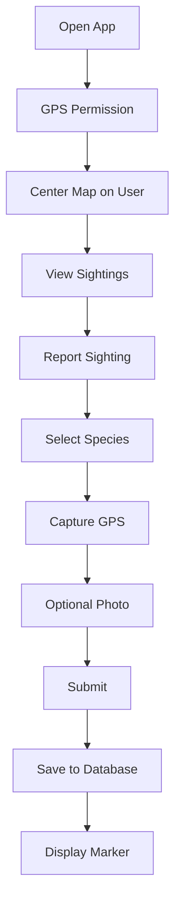

# User Flow

```mermaid
flowchart TD
    A[Open App]
    --> B[GPS Permission]

    B --> C[Center Map on User]

    C --> D[View Sightings]

    D --> E[Report Sighting]

    E --> F[Select Species]

    F --> G[Capture GPS]

    G --> H[Optional Photo]

    H --> I[Submit]

    I --> J[Save to Database]

    J --> K[Display Marker]
```